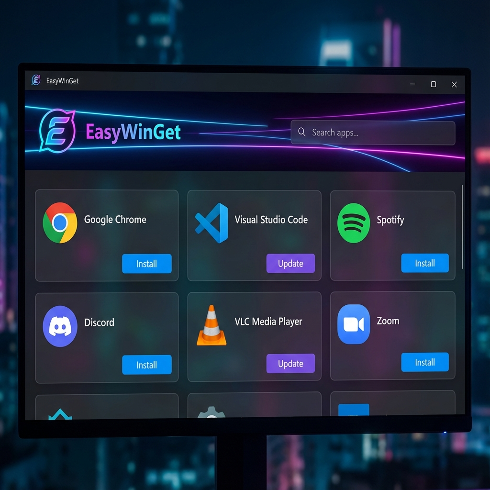

<div align="center">

# EasyWinGet 📦

### The Modern GUI for Windows Package Manager

[](https://opensource.org/licenses/MIT)
[](https://www.microsoft.com/windows)
[](https://nodejs.org/)
[](https://github.com/DARKBOYJYOTI/EasyWinGet)

<p align="center">
  
</p>

[Key Features](#-key-features) •
[Installation](#-installation) •
[Usage](#-usage) •
[Troubleshooting](#-troubleshooting) •
[Contributing](#-contributing)

</div>

---

## 📖 About

**EasyWinGet** is a lightweight, modern web interface that supercharges your experience with the Windows Package Manager (`winget`). Gone are the days of memorizing command-line arguments. EasyWinGet provides a beautiful, responsive dashboard to search, install, and update your Windows applications effortlessly.

Built with **Node.js** and **Express**, it runs a local server that bridges the gap between a friendly web UI and the powerful system-level capabilities of PowerShell.

## ✨ Key Features

- **🎨 Modern Dashboard**: A clean, dark-themed interface inspired by modern design principles.
- **⚡ One-Click Actions**: Install, update, or uninstall applications with a single click.
- **🔍 Instant Search**: Powerfully search through the vast Microsoft WinGet repository.
- **🔄 Bulk Updates**: Automatically detect outdated apps and update them all at once.
- **📵 Offline Capable**: Smart architecture allows for offline dependency installation via `offline-packages`.
- **🛠️ Automated Setup**: The `run.bat` script handles everything—admin elevation, dependency checks, and server startup.
- **🚀 Zero Configuration**: Auto-starts the browser and shuts down the server when you close the tab.

## 🚀 Installation

### Prerequisites

- **Windows 10 (version 1809+)** or **Windows 11**.
- **[App Installer (WinGet)](https://www.microsoft.com/p/app-installer/9nblggh4nns1)**: Usually pre-installed on modern Windows.

### Method 1: Standard (Online)

The easiest way to get started if you have an internet connection.

1.  **Clone** or **Download** this repository.
2.  Double-click **`run.bat`**.
3.  The script will:
    - Check for Node.js (and prompt to install if missing).
    - Install necessary dependencies (`express`, `node-pty`, etc.).
    - Launch the application table in your default browser.

### Method 2: Offline Mode (Air-Gapped) 📵

Perfect for USB usage or isolated environments.

1.  Ensure the `offline-packages` folder is present in the project directory.
2.  (Optional) Place the `node-installer.msi` in `offline-packages/` for a fully offline Node.js setup.
3.  Run **`run.bat`**.
4.  The system will detect the lack of internet/dependencies and automatically install everything from your local offline cache.

## 🕹️ Usage

1.  **Start the App**: Run `run.bat`.
2.  **Search**: Type an app name (e.g., "Chrome", "VS Code") in the search bar.
3.  **Install**: Click the **Download** icon next to any result. Watch the real-time terminal progress.
4.  **Update**: Navigate to the **Updates** tab to see all apps with available upgrades.

> **Note**: The application runs a local server at `http://localhost:8080`. Closing the browser tab will automatically minimize/close the server to save resources.

## 📂 Project Structure

```bash
EasyWinGet/
├── run.bat              # Universal Launcher & Environment Checker
├── server.js            # Core Backend (Express + Node-PTY)
├── gui/                 # Frontend Assets
│   ├── index.html       # Main Dashboard
│   ├── style.css        # Styling & Themes
│   └── script.js        # UI Logic & API Communication
├── utils/               # Backend Helpers
│   ├── jobs.js          # Terminal Job Management
│   ├── winget.js        # Winget CLI Wrapper
│   └── cache.js         # Data Presentation Logic
└── offline-packages/    # Local dependencies storage
```

## ❓ Troubleshooting

| Issue | Solution |
| :--- | :--- |
| **"Node.js not installed"** | The script tries to finding `node`. Install it from [nodejs.org](https://nodejs.org) or place the MSI in `offline-packages`. |
| **Admin Privileges** | `run.bat` auto-requests Admin rights. If denied, the app cannot install software. Please allow the UAC prompt. |
| **Search Not Working** | Ensure `winget` is installed correctly. Open a normal CMD and type `winget`. If it fails, install App Installer from the text file link. |
| **Port 8080 In Use** | If the app fails to start, another service might be using port 8080. Check `server.js` to change the port if needed. |

## 🤝 Contributing

Contributions are welcome! Please feel free to submit a Pull Request.

1.  Fork the repository.
2.  Create your feature branch (`git checkout -b feature/AmazingFeature`).
3.  Commit your changes (`git commit -m 'Add some AmazingFeature'`).
4.  Push to the branch (`git push origin feature/AmazingFeature`).
5.  Open a Pull Request.

## 📝 License

Distributed under the MIT License. See `LICENSE` for more information.

---

<p align="center">
  Made with ❤️ by <a href="https://github.com/DARKBOYJYOTI">Jyoti Karmakar</a>
</p>
